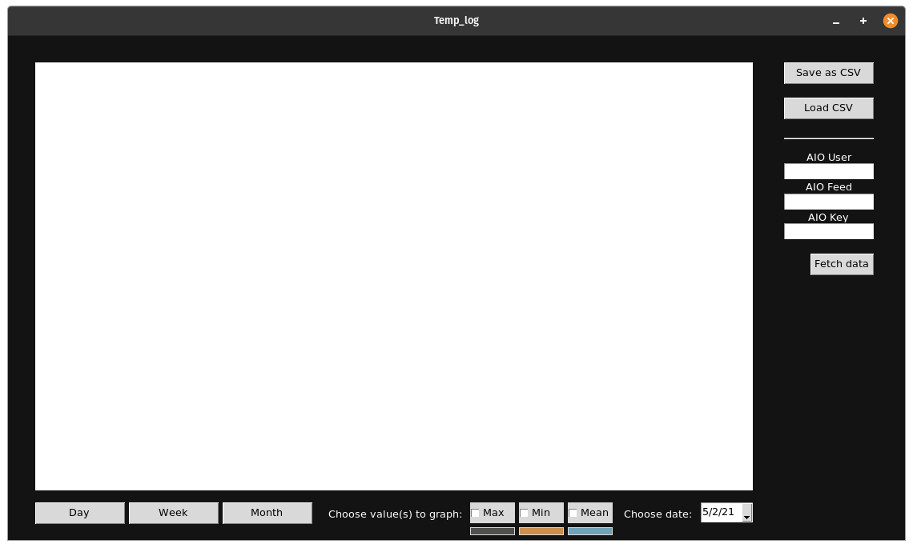

## Temperature log visualizer

---

> Quick running demo

## Overview:

It's a Tkinter GUI app to visualize data coming from my [ULP_Temp_Logger](https://github.com/Rad-hi/ULP_Temp_logger) IoT node.

This desktop app allows anyone deploying my project (aka, me) to:

- Fetch data from any [adafruit.io](https://io.adafruit.com/) feed that has data stored as Json and contains the columns I use.

- Save it into a CSV file.

- Load already fetched data (must have the same columns as the data saved by the app) for plotting.

- Visualize the data according to value (max, min, mean) on the same graph, with the ability to choose a date(by the user through a calendar) and customize the individual graphs' colors(by the user through a color picker). Additionally, data could be plotted for a specific day (picked date), for a week (7 days starting from the picked date), or for a whole month (the month of the picked date).

**Note**: I tested it on randomly generated data, I have some technical issues that prohibit me from running my physical node and get real data uploaded to the broker. 

## Technologies used:

Python 3.9 with: **tkinter, numpy, pandas, matplotlib, calendar, json, Adafruit_IO.Client(build on paho.mqtt), datetime**

## The GUI:

The GUI so far looks like this:

